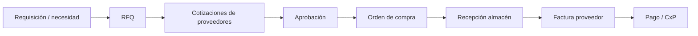

# Análisis del módulo de Compras — HeveLab 2026

Documento de referencia para el Grupo 2. Resume el estado actual del módulo en el repositorio y lo que falta en vistas, filtros, lógica de negocio y capa técnica.

**Fecha de revisión:** mayo 2026  
**Ámbito:** `SolicitudDeCotizacion`, `OrdenesDeCompra`, `Proveedores`

---

## Estado actual (lo que sí hay)

| Pantalla | UI | Lógica |
|----------|----|--------|
| Solicitudes de cotización | Listado, KPIs por estado, filtros, 1 fila demo | Nada conectado |
| Órdenes de compra | Listado, filtros, 1 fila demo | Nada conectado |
| Proveedores | Listado, búsqueda, 1 fila demo | Nada conectado |

Los controladores (`SolicitudDeCotizacionController`, `OrdenesDeCompraController`, `ProveedoresController`) solo exponen `Index()` y devuelven la vista sin datos.

Botones **Nueva Orden / Nuevo**, **Aplicar Filtros**, **Ver/Editar** y enlaces de referencia (`#`) no tienen comportamiento. Los `<select>` de estado solo contienen la opción «Todos los estados».

**Archivos relevantes:**

- `Hevelab2026/Views/SolicitudDeCotizacion/Index.cshtml`
- `Hevelab2026/Views/OrdenesDeCompra/Index.cshtml`
- `Hevelab2026/Views/Proveedores/Index.cshtml`
- Menú en `Hevelab2026/Views/Shared/_Layout.cshtml` (sección Compras)

---

## 1. Vistas y formularios que faltan (UI)

### Proveedores

- **Modal o página** crear/editar: razón social, RUC, dirección, contacto, condiciones de pago, moneda, categoría, estado activo/inactivo.
- **Ficha detalle:** historial de RFQ/OC, evaluación, documentos (RUC, contratos).
- Acciones: activar/desactivar, duplicar, exportar.

### Solicitudes de cotización (RFQ)

- **Formulario nueva RFQ:** comprador, almacén/centro de costo, fecha límite, líneas (producto, cantidad, UoM, notas).
- **Detalle RFQ:** líneas, proveedores invitados, cotizaciones recibidas, comparativo.
- **Modales:** «Enviar a proveedores», «Registrar cotización», «Aprobar proveedor ganador».
- Los **KPIs** (Nuevo, Cotización enviada, Atrasada, etc.) deberían ser clicables para filtrar la tabla.

### Órdenes de compra

- **Formulario nueva OC:** proveedor, moneda, condiciones, dirección de entrega, líneas con precio/cantidad/impuestos.
- **Detalle OC:** timeline de estados, recepciones parciales, facturas vinculadas.
- Acciones: confirmar, cancelar, imprimir/PDF, duplicar desde RFQ aprobada.

### Vistas transversales (no están en el menú pero la UI las insinúa)

- **Recepción de mercancía** (KPI «Recepción atrasada» en RFQ).
- **Facturación / match OC–recepción–factura** (columna «Estado facturación» en OC).
- Opcional: **requisición interna** antes de la RFQ (si la compra no nace siempre en cotización).

---

## 2. Filtros y listados que faltan

### Solicitudes de cotización

- Proveedor, comprador/usuario, tipo (compra vs merma, según el subtítulo de la vista), almacén.
- Rango de fechas con datepicker funcional.
- Estado con valores reales en el `<select>`.
- Búsqueda por referencia/SKU.
- Ordenar columnas y paginación funcional (parcialmente maquetada).

### Órdenes de compra

- **Corrección de etiqueta:** el filtro dice «Cliente / Razón social» y debería ser **Proveedor**.
- Filtros adicionales: comprador, estado OC (borrador, confirmada, parcialmente recibida, cerrada, cancelada), estado facturación, rango de confirmación y entrega esperada, monto, moneda.
- Exportar (Excel/PDF).
- Paginación (hoy solo hay texto «Mostrando 1 de 124» sin controles).

### Proveedores

- Filtro por estado (activo/inactivo), categoría, país/ciudad.
- Aclarar el filtro «Fecha» (¿alta del proveedor? ¿última compra?).
- Paginación y ordenamiento.

---

## 3. Lógica de negocio y flujo del sistema

Flujo típico de compras que el módulo debería soportar y que **hoy no existe en código**:

### RFQ

- Estados con reglas: Nuevo → Enviada → Cotizada → Aprobada / Rechazada / Vencida.
- Alertas por **fecha límite** y **recepción atrasada** (los KPIs ya nombran esto; falta el motor).
- Multiproveedor: una RFQ, N cotizaciones, tabla comparativa y selección del ganador.
- Conversión **RFQ aprobada → OC** (una o varias OC por proveedor).

### Orden de compra

- Numeración automática (`ORD-YYYY-###`).
- Totales: subtotal, impuestos (IGV u otros), descuentos, moneda y tipo de cambio.
- Estados: borrador, confirmada, en tránsito, recibida parcial/total, cerrada, cancelada.
- Restricción de edición tras confirmar (o solo con permiso y auditoría).
- Integración con **inventario** al recibir.

### Proveedores

- Validación de RUC, emails, unicidad.
- Bloqueo de OC si proveedor inactivo o en lista negra.
- Condiciones comerciales por defecto en nuevas OC.

### Recepción y facturación

- Registro de cantidades recibidas vs pedidas (parciales).
- **Three-way match:** OC ↔ recepción ↔ factura; estados FACTURADO / PENDIENTE / DISCREPANCIA.
- Notas de crédito / devoluciones al proveedor.

### Mermas

- El subtítulo de RFQ menciona «compra y mermas»: definir tipo de solicitud, motivo, aprobación distinta e impacto en inventario/costos.

### Transversal ERP

- **Permisos por rol** (comprador, aprobador, almacén, finanzas).
- **Auditoría** (quién cambió qué y cuándo).
- **Notificaciones** (RFQ vencida, OC sin recibir, factura pendiente).
- Enlace con **productos/catálogo**, **almacenes**, **usuarios/compradores**, **contabilidad/CxP**.

---

## 4. Capa técnica que falta (backend)

Según `docs/modulos.md`, un módulo completo incluye Model, Controller con acciones y vistas. En Compras falta casi todo:

| Pieza | Estado |
|-------|--------|
| `Models` (Proveedor, RFQ, OrdenCompra, líneas, estados) | No existen |
| `DbContext` / persistencia | No |
| Acciones MVC (`Create`, `Edit`, `Details`, `Delete`, APIs JSON) | Solo `Index` |
| ViewModels para listados filtrados | No |
| Validación (`DataAnnotations` / FluentValidation) | No |
| JS por módulo (modales, filtros AJAX, datepicker) | No |
| Partial views reutilizables (tabla líneas, modal proveedor) | No |

El **Dashboard** (`Home/Index`) tampoco enlaza ni resume métricas de compras.

---

## 5. Detalles de maquetación a corregir

- Filtro de OC con etiqueta de **cliente** en lugar de **proveedor**.
- Typo en encabezado de tabla: **«Facturaciòn»** → Facturación.
- Estados del `<select>` sin opciones concretas.
- Paginación inconsistente entre pantallas (solo RFQ tiene controles visuales).
- Contadores hardcodeados (124 / 125 / 128 registros) sin datos reales.

---

## Priorización sugerida

1. **Proveedores** — CRUD (base del módulo).
2. **RFQ** — crear → listar → detalle → estados.
3. **OC** — generación desde RFQ ganadora + confirmación.
4. **Filtros + paginación** server-side.
5. **Recepción + facturación** — cierra el ciclo que la UI ya anticipa.
6. Permisos, auditoría e integración con inventario y finanzas.

---

## Próximos pasos (Grupo 2)

- [ ] Definir modelos C# y estados del dominio.
- [ ] Documentar campos por formulario (proveedor, RFQ, OC).
- [ ] Implementar CRUD de proveedores.
- [ ] Conectar listados con datos (mock o BD).
- [ ] Añadir modales/formularios según priorización anterior.

---

*Generado a partir de revisión del código en `Hevelab2026/` — módulo Compras.*
