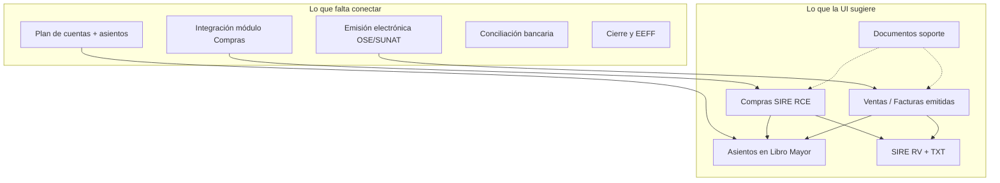

# Análisis del módulo de Contabilidad — HeveLab 2026

Documento de referencia para el Grupo 3. Resume el estado actual del módulo en el repositorio y lo que falta en vistas, filtros, lógica de negocio y capa técnica.

**Fecha de revisión:** mayo 2026  
**Ámbito:** `Facturas`, `LibroMayor`, `Sire`, `Documentos` (layout `_ContabilidadLayout`)

---

## Estado actual (lo que sí hay)

| Pantalla | UI | Lógica real |
|----------|-----|-------------|
| **Facturas** | Listado, KPIs, filtros, orden, paginación, modal detalle, export CSV | Mock en `FacturasController`; filtros/paginación **solo en el navegador** |
| **Libro Mayor** | Gráfico Chart.js, selector cuenta/período, comparativa, búsqueda, plan de cuentas lateral, export CSV | Mock en `LibroMayorController`; solo 3 cuentas y movimientos fijos |
| **SIRE** | Tabs RV/RCE, métricas, formulario 621, filtros, drawer propuesta SUNAT, generar TXT | Mock en `SireController`; “Sincronizar SUNAT” y TXT son **simulados** |
| **Documentos** | Repositorio: categorías, grilla/lista, filtros avanzados, preview drawer, subida drag-drop | Mock en `DocumentosController`; archivos **no se persisten** |

### Arquitectura

- **Layout:** `Hevelab2026/Views/Shared/_ContabilidadLayout.cshtml` (sidebar: Facturas, Libro Mayor, SIRE, Documentos).
- **Entrada ERP:** enlace **Contabilidad** → `/Facturas` en `Views/Shared/_Layout.cshtml`.
- Cada submódulo usa `_ViewStart.cshtml` → layout de contabilidad.
- **Modelos:** `Factura`, `CuentaMayor`, `MovimientoMayor`, `LibroMayorViewModel`, `VentaSire`, `CompraSire`, `SireViewModel`, `DocumentoContable`.
- **Controladores:** solo `Index()` con listas hardcodeadas.
- **No hay** `DbContext`, acciones `Create`/`Edit`/`POST`, APIs ni servicios de dominio.

**Archivos relevantes:**

- `Hevelab2026/Controllers/FacturasController.cs`
- `Hevelab2026/Controllers/LibroMayorController.cs`
- `Hevelab2026/Controllers/SireController.cs`
- `Hevelab2026/Controllers/DocumentosController.cs`
- `Hevelab2026/Views/{Facturas|LibroMayor|Sire|Documentos}/Index.cshtml`

> El módulo se migró desde `Areas/Contabilidad` a la raíz del proyecto (`move_files.ps1`, `update_namespaces.ps1`). Las rutas son planas: `/Facturas`, `/LibroMayor`, `/Sire`, `/Documentos`.

---

## Comparación rápida vs módulo Compras

| Aspecto | Compras | Contabilidad |
|---------|---------|--------------|
| Layout propio | No (shell global) | Sí (`_ContabilidadLayout`) |
| Modelos C# | No | Sí |
| JS interactivo | No | Sí (extenso, inline en vistas) |
| Modales / drawers | No | Sí (detalle, upload, preview, propuesta SUNAT) |
| Filtros funcionales | No | Sí (client-side) |
| Backend / BD | No | No |

Contabilidad está en fase **prototipo funcional de UI**; Compras en fase **wireframe estático**.

---

## 1. Vistas y formularios que faltan (UI)

### Facturas (hoy = solo ventas emitidas)

**Implementado:**

- Modal de **detalle** (ver comprobante).
- Botones ver / imprimir (impresión vía `alert`, sin PDF real).

**Falta:**

- Modal o página **Nueva factura / boleta / nota de crédito** (cabecera + líneas, IGV, serie-correlativo, cliente).
- Flujos **Emitir**, **Anular**, **Nota de crédito desde factura**, reenvío SUNAT/OSE.
- Vista **Facturas de compra** (proveedor, crédito fiscal, vínculo con módulo Compras).
- Detalle con **líneas de producto**, XML/PDF real, hash CPE, estado SUNAT.
- Acciones **Editar** (borrador) y **Duplicar**.

### Libro Mayor

**Implementado:**

- Consulta visual por cuenta y mes, gráfico, export CSV, índice lateral de cuentas (solo lectura).

**Falta:**

- Pantalla **Plan de cuentas** (CRUD: código PCGE, nivel, naturaleza, centro de costo).
- **Asiento contable** (modal o página): cabecera + líneas debe/haber, validación de partida cuadrada.
- **Libro diario** y navegación desde fila → detalle del asiento (`A-00X`).
- Reportes: **Balance de comprobación**, **EEFF**, mayor analítico por centro de costo.
- Corregir referencia JS a `btn-consultar` (elemento **no existe** en el HTML).

### SIRE

**Implementado:**

- Tabs **RVIE** (ventas) y **RCE** (compras).
- Drawer comparativo **Propuesta SUNAT**.
- Panel de filtros avanzados y generación de **TXT local** (descarga simulada).

**Falta:**

- Modal **alta/edición de registro** RV o RC antes del envío.
- Flujo real: importar propuesta SUNAT, reemplazar, enviar, consultar ticket/estado.
- Validaciones SUNAT completas (RUC, tipo doc, fechas, duplicados, tipo de cambio).
- Pantallas **PLE** adicionales si el alcance lo requiere.
- Origen automático de registros desde facturas del ERP (no solo tabla mock).

### Documentos

**Implementado:**

- Modal de subida (mock), drawer de preview, filtros, etiquetas en cliente, ZIP simulado.

**Falta:**

- Subida real a **storage** (blob/disco) con metadatos en BD.
- **Versionado**, permisos por rol, auditoría de descargas.
- Vincular documento a factura, asiento, período SIRE o proveedor.
- OCR / extracción de PDF/XML para precargar registros.
- Eliminación lógica coherente con categoría «Archivados».

### Módulos no presentes en el menú

- Cuentas por cobrar / pagar
- Conciliación bancaria (solo como tipo de documento, no como pantalla de trabajo)
- Tesorería / caja
- Activos fijos y depreciación
- Cierre de período (bloqueo de asientos)
- Configuración: ejercicio fiscal, series, IGV, tipo de cambio

---

## 2. Filtros y listados — gaps y mejoras

### Facturas

**Implementado (cliente):** búsqueda, tipo comprobante, estado, moneda, fechas desde/hasta, limpiar, paginación, orden por columnas, totales en footer, export CSV.

**Falta:**

- Filtros **server-side** para grandes volúmenes.
- Filtro por **serie**, **RUC exacto**, **rango de montos**, **centro de costo**.
- Pestañas **Ventas / Compras / Todos**.
- Alinear **«Ejercicio Activo 2026»** del header con datos (mock usa **2024**).

### Libro Mayor

**Implementado:** cuenta, mes (abr–jun hardcodeado), año 2024, comparar período, búsqueda en descripción.

**Falta:**

- Rango de fechas libre, consulta de **todas las cuentas**, filtro por **número de asiento** y **centro de costo**.
- Meses y años dinámicos según ejercicio activo.
- Paginación server-side en movimientos extensos.

### SIRE

**Implementado:** período tributario, RUC empresa (único), estado de envío (UI), solo observaciones/errores, tipo de operación, rango de montos.

**Falta:**

- Filtro por tercero, tipo documento, **anotado / no anotado** en compras.
- Búsqueda por serie-correlativo.
- Persistir estado Enviado/Aceptado por período en BD.

### Documentos

**Implementado:** categorías laterales, búsqueda, filtros avanzados (nombre, fechas, tamaño, etiquetas, tipo), ordenamiento, vista grilla/lista.

**Falta:**

- Filtro por usuario que subió, comprobante vinculado, políticas de retención.
- Búsqueda en contenido del archivo (no solo nombre/etiqueta).

---

## 3. Lógica de negocio y flujo del sistema

### Facturación electrónica (Perú)

- Numeración correlativa por serie; **IGV 18%** desde líneas (hoy base/IGV/total vienen fijos en mock).
- Estados: borrador → emitida → aceptada SUNAT → anulada.
- Notas de crédito/débito ligadas al documento origen.
- Generación y almacenamiento de **XML / CDR / PDF** en Documentos.

### Contabilidad general

- **Partida doble**: asiento cuadrado; no editar períodos cerrados.
- Automatización: factura venta → asiento ventas + IGV + CxC; factura compra → gasto/activo + crédito fiscal + CxP.
- Libro mayor debe generarse desde **asientos**, no desde arrays estáticos en la vista.

### SIRE / tributario

- Consolidar RV y RC del período; cuadre con **PDT 621** (UI expandible sin persistencia ni presentación real).
- Propuesta SUNAT: drawer y «homologar» son simulación (`alert`).
- Tabla de **tipo de cambio** oficial para compras en USD.

### Documentos y compliance

- Repositorio como evidencia de cierre (balances, conciliaciones, declaraciones) con retención y trazabilidad.
- Enlace real entre descargas y comprobantes/asientos.

### Integración ERP

- **Compras** → factura proveedor → RCE SIRE → asiento → CxP.
- **Ventas** (futuro módulo) → factura cliente → RV SIRE.
- Maestro único de terceros (RUC, razón social).

### Transversal

- Multi-empresa / multi-ejercicio (hoy un solo RUC en SIRE).
- Roles: contador, supervisor, solo lectura SUNAT.
- Auditoría de cambios en asientos y comprobantes.
- **Cierre mensual/anual** con bloqueos.

---

## 4. Capa técnica que falta (backend)

| Pieza | Estado |
|-------|--------|
| Modelos de dominio | Sí (básicos, sin relaciones ni ID de asiento) |
| ViewModels para listados filtrados | Parcial (`LibroMayorViewModel`, `SireViewModel`) |
| `DbContext` / migraciones | No |
| Acciones `Create` / `Edit` / `Delete` / `POST` | No |
| Servicios (SUNAT, OSE, storage) | No |
| JS en `wwwroot/js` | No — lógica inline en `.cshtml` |
| Tests automatizados | No |
| Autenticación / autorización por módulo | No (`Program.cs` solo MVC estándar) |

---

## 5. Detalles a corregir / deuda técnica

- **Fechas inconsistentes:** header «Ejercicio Activo 2026», datos mock en **2024**.
- **Facturas** cubre solo ventas; **SIRE** sí tiene tab de compras (RCE) desconectada de una pantalla de facturas de compra.
- Documentos: texto «Carga simulada instantánea»; descargas con contenido `MOCK`.
- Sincronizar SUNAT, generar TXT y propuesta SUNAT: UX lista, sin API ni cola de envío.
- Impresión de facturas: `alert`, no PDF.
- Libro Mayor: `btn-consultar` referenciado en JS sin botón en HTML.
- Chart.js cargado desde CDN en Libro Mayor.
- Vistas muy extensas (`Documentos/Index.cshtml` ~1700 líneas, `Sire` ~1100): conviene partials y JS modular.

---

## Priorización sugerida

1. **Persistencia** + listados filtrados server-side (Facturas, Documentos).
2. **Plan de cuentas + asientos contables** (origen real del Libro Mayor).
3. **Emisión / anulación** de comprobantes de venta (+ XML en Documentos).
4. **Facturas de compra** integradas con Compras → alimentar SIRE RCE.
5. **SIRE:** import/export y estados de envío por período (integración SUNAT).
6. **Conciliación bancaria** y **cierre de período**.
7. Refactor: JS externo, permisos, multi-ejercicio.

---

## Próximos pasos (Grupo 3)

- [ ] Confirmar alcance tributario (solo SIRE RV/RCE o más PLE).
- [ ] Diseñar esquema BD (comprobantes, asientos, documentos, períodos SIRE).
- [ ] Extraer JS de vistas a archivos en `wwwroot/js/contabilidad/`.
- [ ] Implementar CRUD de asientos y plan de cuentas.
- [ ] Conectar facturas de compra con módulo Compras.
- [ ] Reemplazar mocks de subida/descarga SUNAT por integración real o API intermedia.

---

*Generado a partir de revisión del código en `Hevelab2026/` — módulo Contabilidad.*
