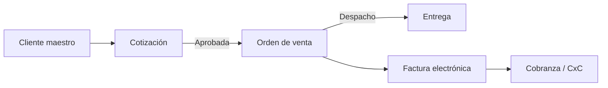

# Análisis del módulo de Ventas — HeveLab 2026

Documento de referencia para el Grupo 5. Resume el estado actual del módulo en el repositorio integrado (`Hevelab2026`) y lo que falta en vistas, filtros, lógica de negocio y capa técnica.

**Fecha de revisión:** mayo 2026  
**Ámbito:** `Clientes`, `Cotizaciones`, `Ordenes` (menú Ventas en `_Layout.cshtml`)

> En `docs/grupo5/` también existen copias de trabajo y planificación (`README.md`, subcarpetas `ventas/`, `Cotizaciones/`, `Ordenes/`). Este análisis describe lo **desplegado y navegable** en la aplicación MVC principal.

---

## Estado actual (lo que sí hay)

| Submódulo | Vistas | Controller | Persistencia |
|-----------|--------|------------|--------------|
| **Clientes** | Index, Detalle, Formulario (crear/editar) | CRUD + filtros GET + `ToggleEstado` POST | Lista estática en memoria (`static List<Cliente>`) |
| **Cotizaciones** | Index, Details, Create, Edit | Listado filtrado + crear/editar POST | Lista estática en memoria |
| **Órdenes** | Index, Details, Create, Edit | Listado filtrado + crear/editar POST | Lista estática en memoria |

**Menú Ventas** (`Views/Shared/_Layout.cshtml`): Clientes → `/Clientes`, Cotizaciones → `/Cotizaciones`, Órdenes → `/Ordenes`.

**Archivos en producción (app):**

- `Hevelab2026/Controllers/ClientesController.cs`
- `Hevelab2026/Controllers/CotizacionesController.cs`
- `Hevelab2026/Controllers/OrdenesController.cs`
- `Hevelab2026/Models/ClienteModel.cs` (`Cliente`)
- `Hevelab2026/Models/Cotizacion.cs`
- `Hevelab2026/Models/OrdenVenta.cs`
- `Hevelab2026/Views/{Clientes|Cotizaciones|Ordenes}/`
- `Hevelab2026/wwwroot/js/clientes.js`, `formulario-cliente.js`
- `Hevelab2026/wwwroot/css/cotizaciones.css`, `ordenes.css`, `forms.css`

---

## Comparación con otros módulos del ERP

| Aspecto | Compras | Ventas (esta rama) | Contabilidad |
|---------|---------|-------------------|--------------|
| Modelos C# | No | Sí | Sí |
| Formularios crear/editar | No | Sí (páginas completas) | Parcial |
| Filtros server-side | No | Sí (parcial) | Mock + cliente en Facturas |
| POST / guardar datos | No | Sí (memoria) | Casi no |
| JS dedicado | No | Sí (Clientes) | Inline en vistas |
| Modales | No | No (usa páginas) | Sí (Facturas, Documentos) |
| Flujo entre submódulos | No | No enlazado | Parcial (SIRE ↔ comprobantes) |
| BD real | No | No | No |

Ventas está **por encima de Compras** (CRUD y filtros reales en memoria) y **por debajo de Contabilidad** en riqueza de UI avanzada (KPIs client-side masivos, drawers), pero con **mejor cobertura de formularios** que Compras.

---

## 1. Vistas y formularios — por submódulo

### Clientes (el más completo)

**Implementado:**

- **Index:** KPIs (total, activos, inactivos, crédito), filtros GET (`busqueda`, `estado`), tabla con selección por radio, acciones ver/editar/activar-desactivar, búsqueda instantánea en cliente (`clientes.js`).
- **Formulario:** crear y editar con POST `GuardarCliente`, validación JS (`formulario-cliente.js`), anti-forgery.
- **Detalle:** ficha del cliente, métricas y tablas de cotizaciones/órdenes.

**Falta:**

- **Modal** rápido de alta (opcional; hoy es página dedicada).
- Historial en Detalle **conectado a datos reales** (hoy badge «Simulado» y filas hardcodeadas).
- Validación servidor (RUC/DNI, email único, documento duplicado).
- Contactos múltiples, direcciones de entrega/facturación, categoría comercial, vendedor asignado.
- Exportar listado (CSV/Excel).
- Eliminar cliente (solo activar/desactivar).

### Cotizaciones

**Implementado:**

- **Index** con formulario GET (cliente, estado), tabla, enlace a Details/Edit, botón **Nuevo** → Create.
- **Create / Edit:** formulario por secciones (cliente, condiciones, montos manuales).
- **Details:** vista de solo lectura.

**Falta:**

- **Líneas de detalle** (producto, cantidad, precio unitario, descuento por línea); hoy solo campos agregados Subtotal/Impuestos/Total manuales.
- Selector de **cliente desde catálogo** (`Clientes`) en lugar de texto libre.
- Cálculo automático de IGV (18%) y totales al editar líneas.
- Acciones de flujo: **Aprobar**, **Rechazar**, **Enviar PDF al cliente**, **Convertir a orden de venta**.
- Modal de detalle rápido (opcional).
- Filtro por **fecha** en backend (el input `fecha` existe en la vista pero **no se usa** en `CotizacionesController.Index`).
- `ValidateAntiForgeryToken` en POST `Edit` (Create sí lo incluye en la vista).
- Eliminar cotización, duplicar, versiones/revisiones.

### Órdenes de venta

**Implementado:**

- **Index** con filtros GET (`fecha`, `busqueda`, `estado`) aplicados en servidor.
- **Create / Edit / Details** con mismos bloques que cotizaciones (sin líneas).
- Validación de **número de pedido duplicado** al crear.

**Falta:**

- Generación automática de número (`S00XX`) en lugar de captura manual.
- **Líneas de pedido** y reserva de stock.
- Origen desde **cotización aprobada** (congelar precios y cliente).
- Estados intermedios: confirmada, en picking, despachada, entregada.
- **Facturar** → enlace con módulo Contabilidad (`/Facturas`).
- Filtro de fecha robusto (hoy `Contains` sobre string `dd/MM/yyyy`, frágil).
- Paginación y ordenamiento en listados grandes.
- Eliminar/cancelar orden con motivo.

### Módulos planificados pero no integrados

Según `docs/grupo5/README.md`:

| Módulo | Estado en app |
|--------|----------------|
| **Reportes / Dashboard Ventas** | No implementado en `Hevelab2026` (solo Dashboard global en `Home`) |
| **Facturas** | Excluido del Grupo 5; existe en **Contabilidad** (`/Facturas`) sin enlace desde Ventas |

---

## 2. Filtros y listados — gaps

### Clientes

| Filtro | Estado |
|--------|--------|
| Búsqueda razón social / documento | GET servidor + búsqueda JS en tabla |
| Estado activo/inactivo | GET servidor |
| Ciudad, tipo cliente, rango crédito | No |
| Paginación | No |

### Cotizaciones

| Filtro | Estado |
|--------|--------|
| Cliente / razón social | GET servidor |
| Estado | GET servidor |
| Rango de fecha | UI sí, **controller no** |
| Vendedor, moneda, monto | No |
| Paginación | No |

### Órdenes

| Filtro | Estado |
|--------|--------|
| Cliente / razón social | GET servidor |
| Estado | GET servidor |
| Fecha (texto parcial) | GET `Contains` sobre string |
| Vendedor, moneda | No |
| Paginación | No |

---

## 3. Lógica de negocio y flujo del sistema

Flujo comercial esperado vs lo implementado:

| Paso | Estado actual |
|------|----------------|
| Alta de cliente | Funcional en memoria |
| Cotización con validez y aprobación | Estados en modelo; sin reglas ni transiciones |
| Cotización → Orden | **No existe** |
| Orden → Factura | **No existe** (Contabilidad aislada) |
| Control de crédito (`LimiteCredito`) | Campo en cliente; **no se valida** al cotizar/vender |
| Inventario / stock | **No** |
| Comisiones por vendedor | Campo texto; sin cálculo |
| Precios y listas | **No** |

### Integración con otros módulos

- **Contabilidad:** facturas y SIRE RV no consumen órdenes de `OrdenesController`.
- **Compras:** sin relación (correcto por dominio).
- **Inventario:** inexistente; no hay SKU en líneas.
- **Maestro de productos:** inexistente.

### Transversal ERP

- Datos **no persisten** al reiniciar el proceso (listas `static` en controladores; en producción requiere BD).
- Sin **autenticación** ni roles (vendedor vs supervisor).
- Sin **auditoría** de cambios.
- Sin **notificaciones** (cotización por vencer, orden pendiente de facturar).

---

## 4. Capa técnica

| Pieza | Estado |
|-------|--------|
| Modelos cabecera | Sí (`Cliente`, `Cotizacion`, `OrdenVenta`) |
| Modelos línea (`DetalleCotizacion`, `DetalleOrden`) | No |
| Relación FK ClienteId | No (texto libre) |
| `DbContext` / EF Core | No |
| Repositorio / servicios de dominio | No |
| ViewModels para formularios complejos | No |
| Validación con DataAnnotations / FluentValidation | Mínima (HTML5 + JS en clientes) |
| API JSON para autocompletar clientes/productos | No |
| Tests | No |

**Deuda en controladores:**

- `CotizacionesController.Edit` POST sin `[ValidateAntiForgeryToken]`.
- `OrdenVenta` sin `Id` numérico; clave natural `NumeroPedido` (válido para demo, limitante para integraciones).
- Fechas en órdenes como `string` vs `DateTime` en cotizaciones (inconsistencia).

**Assets:**

- Cotizaciones usa **Bootstrap Icons** desde CDN (único submódulo con CDN de iconos).
- Estilos repartidos entre `site.css`, `forms.css`, `cotizaciones.css`, `ordenes.css`.

---

## 5. Detalles a corregir / inconsistencias

- Filtro **fecha en Cotizaciones**: campo en vista, lógica ausente en controller.
- **Detalle Cliente:** métricas y tablas marcadas como simuladas; no consultan `CotizacionesController` ni `OrdenesController`.
- Subtítulo de Órdenes Index: «propuestas comerciales» (texto de cotizaciones).
- Breadcrumbs: enlace **Ventas** apunta a `#` en lugar de una landing del módulo.
- **Reportes** del cronograma Grupo 5 no están en el menú ni en código de `Hevelab2026`.
- Duplicación de fuentes en `docs/grupo5/` vs `Hevelab2026/` (riesgo de divergencia al mantener).

---

## Priorización sugerida

1. **Líneas de detalle** + cálculo automático de totales/IGV (Cotizaciones y Órdenes).
2. **Enlace a Clientes** (dropdown/autocomplete por `ClienteId`) en cotización y orden.
3. **Flujo Cotización aprobada → Orden** (una acción, copiar cabecera y líneas).
4. **Persistencia** (EF Core) reemplazando listas estáticas.
5. Filtros faltantes (fecha cotizaciones, paginación) y validación de crédito.
6. **Integración Facturación** con Contabilidad desde orden «Por facturar».
7. **Dashboard Ventas** (pipeline, conversión cotización→orden, ventas por vendedor).
8. Inventario ligero (disponibilidad al confirmar orden).

---

## Próximos pasos (Grupo 5)

- [ ] Implementar filtro `fecha` en `CotizacionesController.Index`.
- [ ] Añadir `DetalleCotizacion` / `DetalleOrden` y UI de grilla de líneas.
- [ ] Conectar Detalle de Cliente con listas reales de cotizaciones/órdenes filtradas por RUC o `ClienteId`.
- [ ] Acción `ConvertirAOrden(int idCotizacion)` en cotizaciones.
- [ ] Unificar tipo `DateTime` en órdenes y formato de fecha en filtros.
- [ ] Documentar en `docs/grupo5/Documentación/MODULO_VENTAS.md` (actualmente vacío) o archivar en favor de este análisis.
- [ ] Definir handoff con Grupo Contabilidad para facturación desde órdenes.

---

*Generado a partir de revisión del código en `Hevelab2026/` — módulo Ventas (Grupo 5).*
